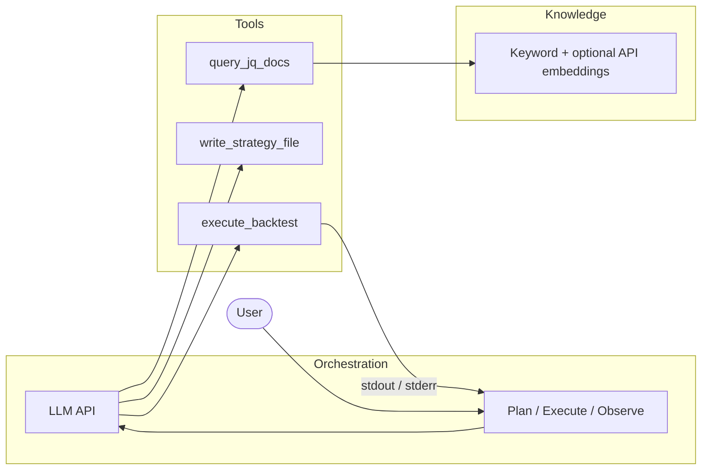

<div align="center">

# jq-agent

**Open-source JoinQuant-style quant Agent framework** — orchestration loop · doc retrieval (keyword + optional API embeddings) · sandboxed tools · optional Web UI.

[](https://github.com/changshenhan/jq-agent)
[](LICENSE)

[中文文档](README.zh-CN.md) · [**AGENTS.md**](AGENTS.md)（AI Agent 协作说明） · [Architecture](#architecture) · [Performance](#performance--latency-mainstream-practices) · [Visualization](#visualization-stack-mainstream-choices) · [IDE Agent](#ide-agent-mode-kilocode-style-workspace) · [对比](#comparison-claw-kilo-jq) · [CLI](#cli--language) · [Tutorial](#integrated-tutorial-bilingual)

</div>

---

## What this project does

**English.** jq-agent is an **open-source orchestration framework** for building **JoinQuant / jqdatasdk–aware quant agents**. It runs a **tool-calling loop** (plan → execute → observe) over a **sandboxed workspace** (under `.jq-agent/`), so the model can look up API snippets, write strategy files, lint them, run backtests in a subprocess, and parse metrics—instead of only chatting. Document retrieval combines **bundled keyword snippets**, optional **user-built slices** from the official GitHub repo, and—when you configure a provider key—**semantic hits** via the provider’s **Embeddings HTTP API**. The CLI is **bilingual (zh/en)**; sessions can be persisted (JSON or SQLite); **MCP stdio** can expose core tools to editors; an optional **FastAPI + SSE** browser UI is available. **It is not** a hosted product or a broker: you bring your own **LLM API** and (for live jqdatasdk) your own **JoinQuant credentials** via environment or `.env` (never commit secrets).

**中文。** jq-agent 是面向 **聚宽 / jqdatasdk** 的**开源 Agent 编排框架**：在 **`.jq-agent/` 沙箱**内完成 **规划 → 执行 → 观察**，支持查文档、写策略、ruff、子进程回测与指标解析；检索融合**关键词**、可选 **GitHub 官方切片**与 **Embeddings API** 语义命中；CLI **中英**；会话可落盘；可选 **浏览器界面（SSE 日志）**。**非**托管产品：需自行配置大模型与聚宽相关环境变量。

---

## Why jq-agent?

| Ordinary chat | jq-agent |
|-----------------|----------|
| Returns prose only | **Plan → Execute → Observe** with **tool calls** |
| Hallucinated APIs | **`query_jq_docs`** against **keyword + optional Embeddings** |
| Unsafe writes | Files & backtests confined to a **sandbox** |

---

## Features

- **Agentic loop** — OpenAI-compatible **function calling** until done or **max iterations**.
- **Tools** — `query_jq_docs`, `read_file`, `write_strategy_file`, `execute_backtest`, `analyze_backtest_metrics`, `lint_strategy_file` (ruff), `research_subtask`; optional **GitHub REST** — `github_search_repositories`, `github_search_users`, `github_get_user`, `github_get_repository` (**`JQ_GITHUB_TOKEN`** / **`GITHUB_TOKEN`** optional for rate limits).
- **IDE Agent tools** (default on; Kilocode-style workspace) — `list_directory`, `glob_files`, `grep_workspace`, `search_replace` (unique match), `run_terminal_cmd` (sandbox cwd; disabled under **`JQ_PERMISSION_MODE=strict`**).
- **Path policy** — paths under workspace **`.jq-agent/`**; optional **`JQ_PERMISSION_MODE=strict`** → writes only **`scratchpad/`**.
- **Sessions** — `jq-agent run --session NAME` / `--resume`; SQLite or JSON backend; **`fork_subagent_session`**; **`jq-agent session tree`**.
- **Streaming** — `jq-agent run --stream` or **`JQ_LLM_STREAM=true`** (SSE).
- **Parallel tools** — **`asyncio.gather`** + **`asyncio.to_thread`** for concurrent tool calls.
- **Compaction** — long histories summarized via LLM (**`JQ_SESSION_COMPACT_*`**).
- **MCP** — **`jq-agent mcp-stdio`** (`pip install 'jq-agent[mcp]'`).
- **Usage log** — optional **`~/.jq-agent/usage.jsonl`**.
- **JSON repair** — malformed tool arguments retried with heuristics.
- **Bilingual CLI** — **`--lang`**, **`JQ_LANG`**, **`jq-agent config lang`**.
- **Terminal UX** — **Rich** panel (goal / steps / tokens), **spinner** for **`execute_backtest`**, colored table for **`analyze_backtest_metrics`**.
- **Equity HTML** — strategy writes **`scratchpad/backtest_equity.csv`** → auto **`scratchpad/backtest_result.html`** (**Plotly 6** interactive chart).
- **Web UI (optional)** — **`pip install 'jq-agent[web]'`** → **`jq-agent web`** → **`/`** (**Vite 6**, **React 19**, **Tailwind 4**, **Pretext** + **TanStack Virtual** for the log); **Fetch Streams**, **rAF**-batched log state + **`/api/run`** SSE; **Stop** = **AbortController**.

---

## IDE Agent mode (Kilocode-style workspace)

jq-agent borrows **workspace + terminal** ideas from products like **Kilo Code** (browse, search, edit, run commands inside a project), while keeping the **JoinQuant / jqdatasdk** tool loop as the primary story.

### What is included (default: `JQ_IDE_AGENT_TOOLS=true`)

| Tool | Purpose |
|------|---------|
| **`list_directory`** | List files and subdirectories under a path in the sandbox (`.jq-agent/`). |
| **`glob_files`** | Glob paths from the sandbox root (e.g. `**/*.py`, capped at 500 hits). |
| **`grep_workspace`** | Line-oriented regex search across files (default glob `**/*.py`). |
| **`search_replace`** | Replace **exactly one** occurrence of `old_string` in a file (IDE-like partial edit). |
| **`run_terminal_cmd`** | Run a **single** parsed command (`shlex`, no shell pipelines) with **cwd = sandbox root**; stdout/stderr merged and truncated (`JQ_TERMINAL_MAX_OUTPUT_CHARS`). |

These tools are also exposed via **`jq-agent mcp-stdio`** so editors (e.g. Cursor) can call them like other MCP tools.

### Safety

- **`JQ_PERMISSION_MODE=strict`**: **`run_terminal_cmd` is disabled** (terminal could otherwise bypass scratchpad-only writes). Other IDE tools remain available for read/search; use **`write_strategy_file`** / **`search_replace`** under **`scratchpad/`** as usual.
- A small **blocklist** rejects obviously dangerous command strings; prefer **`python`**, **`ruff`**, **`pytest`**, etc., inside the sandbox.

### What is *not* included (vs full Kilocode / IDE products)

Not in this repo: **LSP client** wiring (Pyright/Pylance-style diagnostics into context), **first-party VS Code/JetBrains extensions**, **multi-root workspaces**, **hosted cloud sandboxes**, or **Kilo Gateway–style** routing. Those would be separate layers. jq-agent focuses on a **lightweight Python CLI + MCP + optional Web UI** with a **quant-specific** toolset (`query_jq_docs`, **`execute_backtest`**, metrics, Plotly equity HTML).

---

## Project status

| Area | Status |
|------|--------|
| Orchestration, sandbox, tools, sessions, MCP, strict mode, compaction | **Done** |
| Doc retrieval (keyword + slices + Embeddings API) | **Done** |
| CLI visualization + backtest metrics table + Plotly equity chart | **Done** |
| FastAPI + SSE Web UI (`[web]`) | **Done** |
| IDE-style tools (browse / search / patch / terminal in sandbox) | **Done** — `JQ_IDE_AGENT_TOOLS` |
| Full SaaS, broker adapters, bundled local embedding models | **Roadmap** — see below |

---

<h2 id="comparison-claw-kilo-jq">对比：claw-code、Kilo Code 与 jq-agent</h2>

本节对应「对照 **claw-code** 与 **Kilo Code**、比较优劣」一类学习任务：仅依据**公开仓库与文档**表述，不以任何专有泄露代码为权威依据。文中 **claw-code** 指开源的 harness 重写路线（与本仓库同工作区参考的 [instructkr/claw-code](https://github.com/instructkr/claw-code) 一类：Python/Rust、MCP、会话压缩等）。**Kilo Code** 指开源 **[kilo-org/kilocode](https://github.com/kilo-org/kilocode)** 及其 [官方文档](https://kilo.ai/docs/) 所描述的通用编程 Agent 体系。

| 维度 | **claw-code**（harness 重写） | **Kilo Code** | **jq-agent**（本仓库） |
|------|------------------------------|---------------|------------------------|
| **定位** | 面向**通用软件 Agent**：工具、会话、MCP、CLI 等 harness；Rust/Python 双栈 | **IDE 场景编程助手**：中央 CLI + HTTP/SSE、多模型、LSP、工具链，可选云端能力 | **量化 / 聚宽垂直**：jqdatasdk 文档检索、**沙箱**内写策略、**子进程回测**、指标与净值可视化 |
| **交互形态** | CLI / 运行时、插件式工具 | VS Code / JetBrains / 终端 TUI / HTTP API | **轻量 CLI** + 可选 **FastAPI + SSE** 网页 + **MCP stdio** |
| **上下文与记忆** | 会话状态、**压缩（compaction）**、MCP 编排 | 会话管理、检查点、多模式（架构师/编码等） | **JSON / SQLite 会话**、**LLM 压缩**、检索结果写入 **system** |
| **长处** | harness 工程叙事完整；工具与 MCP 清晰；Rust 路径偏性能与工程化 | 产品化程度高：路由多模型、LSP、生态与多端 | **领域贴合**：`query_jq_docs`、官方切片索引、**execute_backtest**、**净值 HTML**；核心栈 **Python**、依赖面可控 |
| **短处 / 代价** | 体量大；不解决聚宽业务与合规细节 | 安装与运维更重；不对 **jqdatasdk** 或券商规则做专门抽象 | **垂直优先**：已提供 **沙箱内 IDE 式工具**（列目录 / glob / grep / 局部替换 / 终端）与 **MCP**，但**不含** Kilocode 级 **LSP 注入、官方 IDE 插件、云端 Gateway**；向量检索依赖 **Embeddings HTTP API**（无内置本地嵌入模型）。 |

**与三者关系：** claw-code 与 Kilo Code 都优先服务**通用写代码**场景；**jq-agent** 有意把工具契约收束到 **聚宽式工作流**（文档 → 策略 → Lint → 回测 → 指标），便于量化侧评审。实现上借鉴了沙箱、压缩、MCP、JSON 修复等常见思路**。

---

## Security & credentials

- **AI agents & MCP hosts:** see **[AGENTS.md](AGENTS.md)** for collaboration rules, tool summary, and env var names (no secrets in-repo).
- **Never commit** API keys, passwords, or phone numbers. Use **`.env`** (listed in **`.gitignore`**) or shell exports; start from **`.env.example`** only as a template.
- Configure **`JQ_LLM_API_KEY`** (or legacy **`JQ_OPENAI_API_KEY`**) for OpenAI-compatible Chat + Embeddings. JoinQuant / **`jqdatasdk`** credentials belong in **your** environment when you run strategies—**not** in the repository.

---

## Architecture



---

## Performance & latency (mainstream practices)

This project optimizes **perceived and wall-clock latency** along lines common in production LLM clients:

| Practice | What jq-agent does |
|----------|---------------------|
| **Time-to-first-token (TTFT)** | Enable **`JQ_LLM_STREAM=true`** (or `--stream`) so tokens render over **SSE** instead of waiting for the full completion. |
| **HTTP/2** ([RFC 7540](https://www.rfc-editor.org/rfc/rfc7540)) | **`h2`** is a core dependency; **`httpx`** uses **HTTP/2** when **`JQ_LLM_HTTP2=true`** (default) and the provider supports it — better **multiplexing** on a single connection to the API edge. |
| **Connection reuse** | **Keep-alive pools** (`JQ_LLM_HTTP_KEEPALIVE`, **`JQ_LLM_HTTP_MAX_CONNECTIONS`**) so multi-turn **Agent loops** avoid repeated **TCP + TLS handshakes** on every chat/embed call. |
| **Staged timeouts** | Separate **connect** vs **read** timeouts (`JQ_LLM_HTTP_CONNECT_TIMEOUT`, **`JQ_LLM_HTTP_READ_TIMEOUT`**) — fail fast on dead endpoints; allow long generations. |
| **Embeddings client reuse** | **`embed_texts`** uses a **persistent sync `httpx.Client`** per base URL + key prefix (not one short-lived client per call). |
| **Semantic index cache** | After `index build`, **`chunks.json` + `embeddings.json`** are **memory-cached** (invalidated on file mtime) to avoid re-reading large JSON on every **`query_jq_docs`**. |
| **Parallel tool calls** | Already **asyncio.gather** + **to_thread** for concurrent tools in one model turn. |

**Optional provider-side features** (outside this repo): **prompt caching** / **prefix caching** on OpenAI-compatible endpoints — enable in your provider dashboard if available; jq-agent sends standard Chat Completions requests compatible with those features.

---

## Visualization stack (mainstream choices)

| Layer | Library | Role |
|-------|---------|------|
| **Interactive charts** | **Plotly.py ≥ 6** | HTML equity curves (`scratchpad/backtest_result.html`), CDN `plotly.js`, responsive toolbar — the de facto standard for browser-native quant dashboards in Python. |
| **Terminal UI** | **Rich ≥ 14** | Panels, spinners, colored metric tables — widely adopted for modern Python CLIs. |
| **CLI framework** | **Typer ≥ 0.24** | Built on Click; standard for typed command-line apps. |
| **Optional Web UI** | **Vite 6 · React 19 · TS · Tailwind 4 · FastAPI SSE** | Production bundle under **`jq_agent/web/static/`** (committed so `pip install` works). Log column uses [**chenglou/pretext**](https://github.com/chenglou/pretext) (`@chenglou/pretext`) for **pre-wrap line layout without DOM reflow**, plus **TanStack Virtual** for viewport-only rows. Chunks still merge via **refs + rAF**; **startTransition** for status. Dev: **`npm run dev`** (**5173**) proxies **`/api`** to **`jq-agent web`** (**8765**). **Do not gzip** `text/event-stream` behind a proxy. |
| **Examples** | **Plotly only** | `examples/plot_demo.py` matches the core chart stack (no parallel matplotlib dependency). |

**Web UI latency & smoothness:** SSE text is merged in a **ref buffer** and flushed on **requestAnimationFrame** (one **`setLogText`** per frame). **Pretext** computes wrapped lines at a fixed width (aligned with the log `font` CSS) so long transcripts virtualize without measuring **`offsetHeight`**. Rebuild after UI edits: `cd jq_agent/web/frontend && npm ci && npm run build`.

---

## Quick start

```bash
git clone https://github.com/changshenhan/jq-agent.git
cd jq-agent
python -m venv .venv && source .venv/bin/activate   # Windows: .venv\Scripts\activate
pip install -e .
pip install -e ".[web]"    # optional: jq-agent web
cp .env.example .env       # edit locally; do not commit
```

The Web UI is a **Vite-built** SPA; the wheel already includes **`jq_agent/web/static/`**. To **rebuild** after changing `jq_agent/web/frontend/`:

```bash
cd jq_agent/web/frontend && npm ci && npm run build
```

**Dev workflow (hot reload):** terminal A — `jq-agent web` → **8765**; terminal B — `cd jq_agent/web/frontend && npm run dev` → **5173** (proxies API to 8765). Open **http://127.0.0.1:5173/**.

Configuration is read from the **current working directory** (`.env` or environment variables).

### Doc index (official jqdatasdk → JSON; optional Embeddings)

Sources: [**JoinQuant/jqdatasdk**](https://github.com/JoinQuant/jqdatasdk) → slices → **`~/.jq-agent/jqdatasdk_index/chunks.json`**. With a provider key, **`jq-agent index build`** can call **`/v1/embeddings`** for semantic **`query_jq_docs`**.

```bash
jq-agent index build
jq-agent index status
# jq-agent index build --full   # large: alpha101 / alpha191 / technical_analysis
```

### Environment variables (reference)

| Variable | Role |
|----------|------|
| `JQ_LLM_API_KEY` | Chat + embeddings (legacy: `JQ_OPENAI_API_KEY`) |
| `JQ_LLM_BASE_URL` | Default `https://api.openai.com/v1` |
| `JQ_EMBEDDING_MODEL` | Embeddings model id |
| `JQ_MODEL` | Chat model id |
| `JQ_MAX_ITERATIONS` | Loop cap (default `16`) |
| `JQ_LANG` | CLI UI: `zh` or `en` |
| `JQ_BACKTEST_TIMEOUT_SEC` | Subprocess timeout for **`execute_backtest`** |
| `JQ_LLM_STREAM` | SSE streaming for chat |
| `JQ_PERMISSION_MODE` | `normal` or `strict` (writes → `scratchpad/` only) |
| `JQ_USAGE_LOG` | Append usage to `~/.jq-agent/usage.jsonl` |
| `JQ_SESSION_BACKEND` | `sqlite` or `json` |
| `JQ_SESSION_COMPACT_THRESHOLD` / `JQ_SESSION_COMPACT_KEEP` | Session compaction |
| `JQ_PHONE` / `JQ_PASSWORD` | JoinQuant / **`jqdatasdk`** when running real backtests |
| `JQ_IDE_AGENT_TOOLS` | `true` / `false` — enable IDE tools (`list_directory`, `glob_files`, `grep_workspace`, `search_replace`, `run_terminal_cmd`) |
| `JQ_TERMINAL_TIMEOUT_SEC` | Timeout for **`run_terminal_cmd`** (default `120`) |
| `JQ_TERMINAL_MAX_OUTPUT_CHARS` | Max combined stdout+stderr chars from **`run_terminal_cmd`** |
| `JQ_GITHUB_TOOLS` | `true` / `false` — enable **`github_*`** tools (GitHub REST API) |
| `JQ_GITHUB_TOKEN` | Optional GitHub token (or use standard **`GITHUB_TOKEN`**) for higher API rate limits |
| `JQ_LLM_HTTP2` | `true` / `false` — use HTTP/2 for LLM HTTP clients (requires **`h2`**) |
| `JQ_LLM_HTTP_CONNECT_TIMEOUT` | Connect timeout (seconds), default `15` |
| `JQ_LLM_HTTP_READ_TIMEOUT` | Read timeout (seconds), default `300` |
| `JQ_LLM_HTTP_KEEPALIVE` | Keep-alive pool size, default `32` |
| `JQ_LLM_HTTP_MAX_CONNECTIONS` | Max connections cap, default `100` |

See **`.env.example`** for the full list and comments. Tuning guide: [Performance & latency](#performance--latency-mainstream-practices).

### Run

```bash
jq-agent doctor
jq-agent run "Look up get_price in the docs and summarize in one sentence."
```

**DeepSeek (example)**

```bash
export JQ_LLM_BASE_URL=https://api.deepseek.com/v1
export JQ_MODEL=deepseek-chat
jq-agent run "Query docs for 沪深300 index symbol"
```

Set secrets via **`export`** or entries in **`.env`** (not committed).

---

## CLI & language

| Command | Purpose |
|---------|---------|
| `jq-agent doctor` | Sandbox path, key presence, model, doc index status |
| `jq-agent run "..."` | Agent loop |
| `jq-agent run --session NAME --resume` | Continue session |
| `jq-agent run --stream` | SSE streaming |
| `jq-agent config lang` / `config show` | UI language (persisted) |
| `jq-agent index build` / `index status` | Doc slices + optional embeddings |
| `jq-agent session list` / `path` / `tree` | Sessions |
| `jq-agent mcp-stdio` | MCP (`pip install 'jq-agent[mcp]'`) |
| `jq-agent web` | Browser UI (`pip install 'jq-agent[web]'`) |

Priority: **`--lang` > `JQ_LANG` > saved config > `zh`**.

---

## Roadmap · next step

Pluggable **local / self-hosted embedding** backends (explicit opt-in) for deployments that cannot use cloud Embeddings—without binding a single vendor. Chat and embeddings today are **HTTP APIs** only.

---

## Integrated tutorial (bilingual)

Copy-paste paths may differ on your OS.

### English

1. Clone & install — see [Quick start](#quick-start). Optional: **`pip install 'jq-agent[mcp]'`** or **`'jq-agent[web]'`**.
2. Copy **`.env.example`** → **`.env`** and fill keys **locally** (never commit).
3. **`jq-agent doctor`** — verify sandbox, keys, index.
4. **`jq-agent index build`** (optional) — **`index status`** for metadata.
5. **`jq-agent config lang en`** if you want English CLI labels.
6. **`jq-agent run "…"`** — try a doc query; use **`--session`** / **`--resume`** for multi-turn.
7. For **live jqdatasdk** backtests, set account-related vars per JoinQuant docs; copy **`examples/real_price_smoke.py`** into **`scratchpad/`** and call **`execute_backtest`** from the agent (`pip install jqdatasdk`).
8. **`JQ_PERMISSION_MODE=strict`** — restrict writes to **`scratchpad/`**.
9. **`jq-agent mcp-stdio`** — wire MCP hosts (e.g. Cursor).
10. **IDE Agent tools** — with **`JQ_IDE_AGENT_TOOLS=true`** (default), the model can use **`list_directory`**, **`glob_files`**, **`grep_workspace`**, **`search_replace`**, **`run_terminal_cmd`** inside the sandbox; set **`JQ_PERMISSION_MODE=strict`** if you want to disable the terminal tool.

### 中文

1. 克隆与安装见 [Quick start](#quick-start)；可选安装 **`[mcp]`**、**`[web]`**。
2. 复制 **`.env.example`** 为 **`.env`**，仅在本地填写密钥（**勿提交**）。
3. **`jq-agent doctor`** 检查环境与索引。
4. **`jq-agent index build`** / **`index status`**（可选）。
5. **`jq-agent config lang zh`** 等设置界面语言。
6. **`jq-agent run "…"`** 试跑；需要时用 **`--session`** / **`--resume`**。
7. 真实行情回测：按聚宽要求配置账号相关变量；可将 **`examples/real_price_smoke.py`** 放入 **`scratchpad/`** 并通过工具执行（需 **`jqdatasdk`**）。
8. **`JQ_PERMISSION_MODE=strict`** 限制仅写入 **`scratchpad/`**。
9. **`jq-agent mcp-stdio`** 接入 MCP 宿主。
10. **IDE Agent 工具** — 默认 **`JQ_IDE_AGENT_TOOLS=true`** 时可用列目录、glob、grep、局部替换、沙箱终端；若需禁用终端命令，使用 **`JQ_PERMISSION_MODE=strict`**（见上文 [IDE Agent](#ide-agent-mode-kilocode-style-workspace)）。

---

## Disclaimer

For **research and education** only. **Not** investment advice. You are responsible for compliance with exchanges and data licenses.

---

## License

MIT — see [LICENSE](LICENSE).
