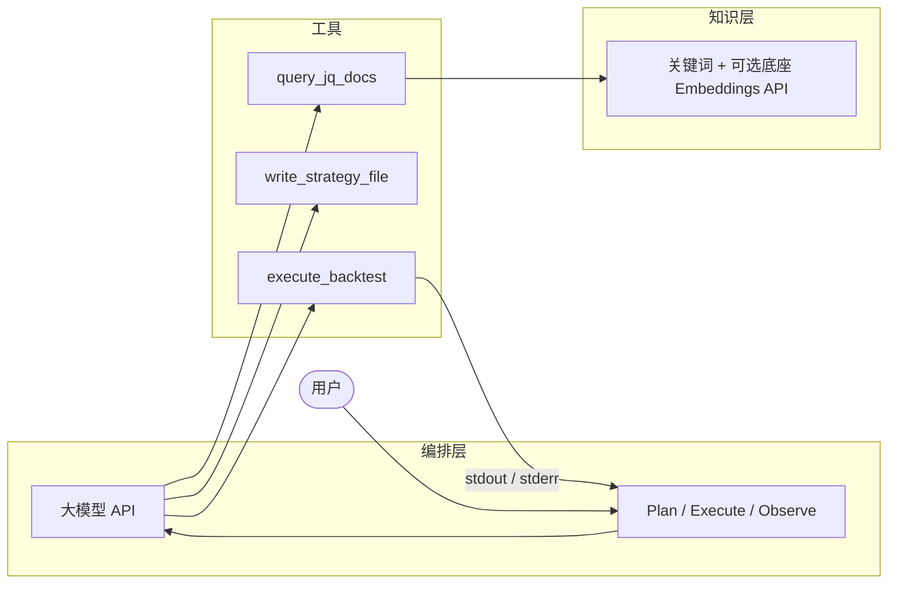

<div align="center">

# jq-agent

**聚宽生态量化 Agent 开源框架** — 编排闭环 · 文档检索（关键词 + 可选底座 Embeddings API）· 沙箱工具。

[](https://github.com/changshenhan/jq-agent)
[](LICENSE)

[English README](README.md) · [**AGENTS.md**](AGENTS.md)（供 AI Agent / MCP 宿主阅读） · [终端与工具阶段](#终端与工具阶段借鉴-open-harness) · [架构说明](#架构) · [性能与延迟（英文详解）](README.md#performance--latency-mainstream-practices) · [可视化栈（英文详解）](README.md#visualization-stack-mainstream-choices) · [命令行与语言](#命令行与语言) · [集成教程（中英，见 README.md）](README.md#integrated-tutorial-bilingual)


</div>

---

## 为什么选择 jq-agent？

| 普通对话 | jq-agent |
|----------|----------|
| 只返回文字 | **Plan → Execute → Observe**，以 **工具调用** 为边界 |
| 易编造 API | **`query_jq_docs`** 查 **关键词 + 可选 API 语义缓存** |
| 随意写盘 | 文件与回测限制在 **沙箱目录** 内 |

---

## 功能概览

- **Agent 循环** — 多轮调用兼容 OpenAI 的 **Function Calling**，直到结束或达到 **最大轮数（熔断）**。
- **工具集** — `query_jq_docs`、`read_file`、`write_strategy_file`、`execute_backtest`、`analyze_backtest_metrics`、`lint_strategy_file`（ruff）、`research_subtask`（单轮 LLM）；可选 **GitHub 公开 API** — `github_search_repositories`、`github_search_users`、`github_get_user`、`github_get_repository`（可选 **`JQ_GITHUB_TOKEN`** / **`GITHUB_TOKEN`** 提配额）。
- **IDE Agent 工具**（默认开启，对标 Kilocode 工作区）— `list_directory`、`glob_files`、`grep_workspace`、`search_replace`（唯一匹配）、`run_terminal_cmd`（沙箱根目录执行；**strict** 模式下禁用终端）。
- **路径策略** — 路径须在 `.jq-agent` 工作区内；可选 **`JQ_PERMISSION_MODE=strict`**，仅允许写入 `scratchpad/`。
- **会话落盘** — `jq-agent run --session 名称` 将消息存到 `~/.jq-agent/sessions/`；`--resume` 接续历史。
- **流式** — `--stream` 或 `JQ_LLM_STREAM=true`，SSE 降低首字延迟。
- **并行工具** — 同一轮多个 tool call 用 **asyncio.gather + asyncio.to_thread** 并行（编排层全 async）。
- **SQLite 会话与树** — 默认 SQLite 存会话，支持父子分支；工具 `fork_subagent_session`；`jq-agent session tree`。
- **Compaction** — 历史超过阈值时用 LLM 摘要写入 system（对标 Kilo 压缩）。
- **MCP stdio** — `pip install 'jq-agent[mcp]'` 后执行 `jq-agent mcp-stdio`，对外暴露部分工具。
- **模型路由** — 按模型 / Base URL 追加简短 system 片段（`prompts/router.py`）。
- **用量日志** — 可选写入 `~/.jq-agent/usage.jsonl`。
- **JSON 修复** — 工具参数解析失败时尝试去围栏与启发式修复。
- **中英界面** — 通过 `--lang`、`JQ_LANG` 或 `jq-agent config lang` 切换 CLI **提示与标签**（与模型 system prompt 独立）。
- **检索状态可见** — `jq-agent doctor` 与运行时 **system** 会说明切片索引与 Embeddings 缓存是否就绪。
- **终端可视化** — 每轮迭代开始用 **Rich** 展示**任务目标、已用步数、累计 Token**；**单次**工具调用时 Spinner 文案**按工具名**显示；**并行多工具**时用一条总提示，避免多路 Spinner 互相打断（思路参考 [Open Harness](https://github.com/Open-Harness/open-harness) harness-loop，详见 [AGENTS.md](AGENTS.md)）；**`analyze_backtest_metrics`** 用**彩色表格**展示夏普、回撤、收益等。
- **净值曲线 HTML** — 回测成功且策略写出 **`scratchpad/backtest_equity.csv`** 时，工具自动生成 **`scratchpad/backtest_result.html`**（**Plotly 6** 交互图，依赖已包含 **pandas**、**plotly**），并可尝试用系统浏览器打开。
- **可选 Web 界面** — **`Vite 6 + React 19 + Tailwind 4`**（`jq_agent/web/frontend/` → `jq_agent/web/static/`）。日志区用 [**Pretext**](https://github.com/chenglou/pretext)（`@chenglou/pretext`）做 **pre-wrap** 折行 + **TanStack Virtual**；**`/api/run`** SSE 除 **`log`** 外还可下发结构化 **`tool`** 事件（`phase` / `name`），供状态行显示「工具: …」。**`jq-agent web`**（8765）、**AbortController** 停止。构建：`cd jq_agent/web/frontend && npm ci && npm run build`；开发：`npm run dev`（5173）。

---

## 终端与工具阶段（借鉴 Open Harness）

本仓库**未**引入 Open Harness 的 TypeScript / Effect 技术栈，但借鉴其 **harness-loop** 的两点：**按工具名更新进度**、**结构化工具起止**（详见 **[AGENTS.md](AGENTS.md)**「借鉴 Open Harness」）。CLI 与 Web 行为以英文 **[README.md](README.md#ux--tool-phases-open-harnessinspired)** 为准。

---

## 项目完成度（简要）

| 模块 | 状态 |
|------|------|
| 编排闭环、沙箱、工具、会话、MCP、严格写权限、压缩、用量日志 | **已完成**（MVP） |
| 文档检索：关键词 + 可选 GitHub 切片 + 底座 Embeddings 缓存 | **已完成** |
| 终端体验（面板、回测等待动画、指标表） | **已完成** |
| 回测 CSV → Plotly 净值图 | **已完成**（需策略输出约定 CSV） |
| 浏览器最小界面（FastAPI + SSE） | **已完成**（可选 **`[web]`** 依赖） |
| IDE 级沙箱工具（列目录 / 搜索 / 局部替换 / 终端） | **已完成**（`JQ_IDE_AGENT_TOOLS`） |
| 完整托管产品、券商对接、内置本地嵌入模型 | **暂无**（见 [README.md Roadmap](README.md#roadmap--next-step)） |

**粗估：** 对 README 所描述的 **MVP（CLI Agent + 检索 + 沙箱工具 + 可观测性）** 约 **85%～90%** 已落地；后续主要是**可选的本地/自建嵌入适配**与体验打磨，而非缺少核心闭环。

**关于测试：** 仓库目录 **`tests/`** 为 **pytest 自动化回归**，发布前请执行 **`pytest`**（见下文「发布前自检」）。**不建议删除**，与临时沙箱脚本不同。

---

## 安全与凭据

- **AI Agent / MCP 宿主：** 协作约定与工具清单见 **[AGENTS.md](AGENTS.md)**（勿在仓库中写入真实密钥）。
- **切勿**将 API 密钥、聚宽网站密码或手机号提交到 Git。请使用本地 **`.env`**（已 gitignore）或终端 `export`；可复制 **`.env.example`** 后自行填写。
- **本工具不收集**聚宽网页登录信息。请配置 **`JQ_LLM_API_KEY`**（或旧名 `JQ_OPENAI_API_KEY`），用于 **OpenAI 兼容的 Chat 与 Embeddings** 接口。若策略在实盘中调用 `jqdatasdk`，请按聚宽要求在 **策略代码或运行环境** 中自行配置鉴权，与本 CLI 无关。

---

## 架构



### 性能与延迟（概要）

与业界 LLM 客户端常见做法对齐：**首字延迟**靠 **`JQ_LLM_STREAM`**；**RFC 7540 HTTP/2** 多路复用、**keep-alive** 减少多轮握手；**分阶段超时**（`JQ_LLM_HTTP_CONNECT_TIMEOUT` / `JQ_LLM_HTTP_READ_TIMEOUT`）；检索侧 **索引文件缓存**。完整参数表与说明见英文 **[README — Performance & latency](README.md#performance--latency-mainstream-practices)**。

### 可视化栈（概要）

- **交互图**：**Plotly.py 6.x**（净值 HTML、CDN `plotly.js`）。
- **终端**：**Rich**（面板、表格、Spinner）。
- **CLI**：**Typer**。
- **可选 Web**：**Vite + React 19 + Tailwind 4** + **FastAPI SSE**（详见 **[README — Visualization stack](README.md#visualization-stack-mainstream-choices)**）。

---

## 快速开始

```bash
cd jq-agent
python -m venv .venv && source .venv/bin/activate
pip install -e .
cp .env.example .env         # 可选：在本地填写 JQ_*（切勿提交 .env）
```

配置从**当前工作目录**读取：在运行 `jq-agent` 的目录放置 `.env`，或仅使用环境变量。

Web 界面为 **Vite** 构建产物（`jq_agent/web/static/` 已随包附带）。修改 `jq_agent/web/frontend/` 后请执行：

```bash
cd jq_agent/web/frontend && npm ci && npm run build
```

开发调试：终端 A 运行 **`jq-agent web`**（8765），终端 B 运行 **`npm run dev`**（5173，代理 `/api` 到 8765），浏览器打开 **http://127.0.0.1:5173/**。

### 文档索引（官方 SDK 切片 → JSON；语义向量由底座模型 Embeddings API 可选生成）

文档来源为 [**JoinQuant/jqdatasdk**](https://github.com/JoinQuant/jqdatasdk)，按 **AST / Markdown** 切段，写入 **`~/.jq-agent/jqdatasdk_index/chunks.json`**。若已配置 **`JQ_LLM_API_KEY`**，`jq-agent index build` 会调用服务商的 **`/v1/embeddings`** 写入语义缓存（**不内置本地嵌入模型**）。

```bash
jq-agent index build          # 切片 + 可选 API 语义缓存（无 Key 则仅关键词）
jq-agent index status
jq-agent index build --full   # 额外索引 alpha101 / alpha191 / technical_analysis（文件很大）

# 可选：在仓库 .env 中设置 JQ_DOC_INDEX_DIR=jq_index（相对路径），再执行 index build，索引落在项目内便于团队共享；embeddings.json 通常很大，可 gitignore 只提交 chunks.json
```

未配置 Key 时，`query_jq_docs` 使用 **内置关键词片段** 与已构建的 **chunks**（偏关键词）；有 Embeddings 缓存时 **语义与关键词混合**。

### 环境变量

| 变量 | 说明 |
|------|------|
| `JQ_LLM_API_KEY` | 底座 API Key（兼容旧名 `JQ_OPENAI_API_KEY`） |
| `JQ_LLM_BASE_URL` | 默认 `https://api.openai.com/v1`；DeepSeek 示例：`https://api.deepseek.com/v1` |
| `JQ_EMBEDDING_MODEL` | Embeddings 模型 id（默认 `text-embedding-3-small`） |
| `JQ_MODEL` | 如 `gpt-4o-mini`、`deepseek-chat` |
| `JQ_MAX_ITERATIONS` | Agent 最大循环次数（默认 `16`） |
| `JQ_DOC_INDEX_DIR` | 可选；文档索引目录（默认 `~/.jq-agent/jqdatasdk_index`），设为如 `jq_index` 则索引生成在项目内，配合 `.env` 固定路径 |
| `JQ_AGENT_TASK_MODE` | `auto`（关键词识别后注入 jqdatasdk 快路径）/ `jq_sdk`（始终快路径）/ `general`（不注入）；CLI `--task-mode`；Web 可选覆盖 |
| `JQ_LANG` | 界面语言：`zh` 或 `en` |
| `JQ_BACKTEST_TIMEOUT_SEC` | `execute_backtest` 子进程超时秒数（默认 `120`） |
| `JQ_LLM_STREAM` | `true` / `false` — 是否 SSE 流式调用 chat completions |
| `JQ_LLM_HTTP2` | `true` / `false` — 是否对 LLM 使用 HTTP/2（需已安装 `h2`） |
| `JQ_LLM_HTTP_CONNECT_TIMEOUT` / `JQ_LLM_HTTP_READ_TIMEOUT` | 连接与读超时（秒） |
| `JQ_LLM_HTTP_KEEPALIVE` / `JQ_LLM_HTTP_MAX_CONNECTIONS` | 连接池 keep-alive 与最大连接数 |
| `JQ_PERMISSION_MODE` | `normal`（默认）或 `strict`（仅允许写入 `scratchpad/`） |
| `JQ_USAGE_LOG` | 是否记录用量到 `~/.jq-agent/usage.jsonl` |
| `JQ_AUTO_PARSE_BACKTEST_METRICS` | 为 `true` 时，`execute_backtest` 的 JSON 可含 `auto_parsed_metrics` |
| `JQ_SESSION_BACKEND` | `sqlite`（默认，`~/.jq-agent/jq_agent.sqlite3`）或 `json` |
| `JQ_SESSION_COMPACT_THRESHOLD` | 超过该条数触发 **会话压缩**（摘要早期轮次） |
| `JQ_SESSION_COMPACT_KEEP` | 压缩后保留尾部条数 |
| `JQ_GITHUB_TOOLS` | `true` / `false` — 是否启用 **`github_*`** 工具（GitHub REST API） |
| `JQ_GITHUB_TOKEN` | 可选 GitHub token（或与标准变量 **`GITHUB_TOKEN`**）提高 API 配额 |

### 运行示例

```bash
export JQ_LLM_API_KEY=sk-...
jq-agent doctor
jq-agent run "查文档里 get_price 的用法并用一句话总结"
```

**DeepSeek 示例**

```bash
export JQ_LLM_BASE_URL=https://api.deepseek.com/v1
export JQ_MODEL=deepseek-chat
jq-agent run "查文档里沪深300的指数代码写法"
```

---

## 命令行与语言

| 命令 | 作用 |
|------|------|
| `jq-agent --lang en doctor` | 本次命令使用英文界面 |
| `jq-agent config lang en` | 将默认界面语言写入 `~/.jq-agent/settings.json` |
| `jq-agent config lang` | 查看当前已保存的语言 |
| `jq-agent config show` | 显示配置文件路径与当前语言 |
| `jq-agent index build` | 从 GitHub 拉取 jqdatasdk 并构建切片索引（可选 API 语义缓存） |
| `jq-agent index build --index-dir DIR` | 单次覆盖 **`JQ_DOC_INDEX_DIR`** |
| `jq-agent index status` | 查看索引路径与元数据 |
| `jq-agent run --task-mode <mode>` | 覆盖 **`JQ_AGENT_TASK_MODE`**（`auto` / `jq_sdk` / `general`） |
| `jq-agent session list` | 列出已保存会话名 |
| `jq-agent session path 名称` | 打印该会话 JSON 路径 |
| `jq-agent session tree` | SQLite：列出会话父子与更新时间 |
| `jq-agent mcp-stdio` | 启动 MCP stdio 服务（需 `pip install 'jq-agent[mcp]'`） |
| `jq-agent web` | 启动 FastAPI 与 SSE（需 `pip install 'jq-agent[web]'`；`--host` / `--port`） |

**优先级**：`--lang` > `JQ_LANG` > 配置文件 > 默认 `zh`。

---

## 发布前自检（维护者）

- [ ] 干净虚拟环境：`pip install -e ".[dev]"`
- [ ] `pytest` 与 `ruff check jq_agent tests`
- [ ] `jq-agent doctor` — API Key 行与 **文档检索** 区块；可选 `jq-agent index build`
- [ ] 冒烟：用真实服务商执行 `jq-agent run "用一词回复 OK。" --max-iter 2`
- [ ] 确认发布目录中无 `.env` 或密钥

---

## 开发

```bash
pip install -e ".[dev]"
pytest
ruff check jq_agent tests
```

---

## 免责声明

本工具仅供 **研究与学习**，**不构成投资建议**。连接真实行情或交易前，请自行遵守交易所规则与数据授权。

---

## 许可证

MIT — 见 [LICENSE](LICENSE)。
